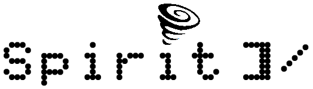
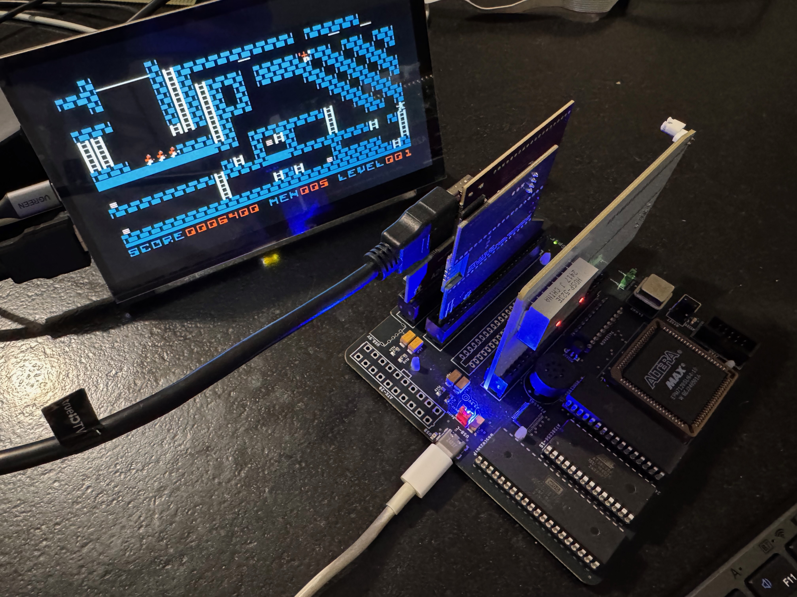
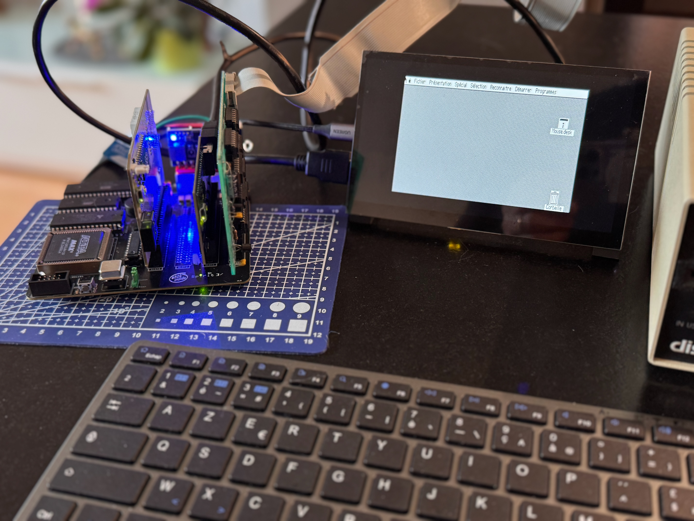
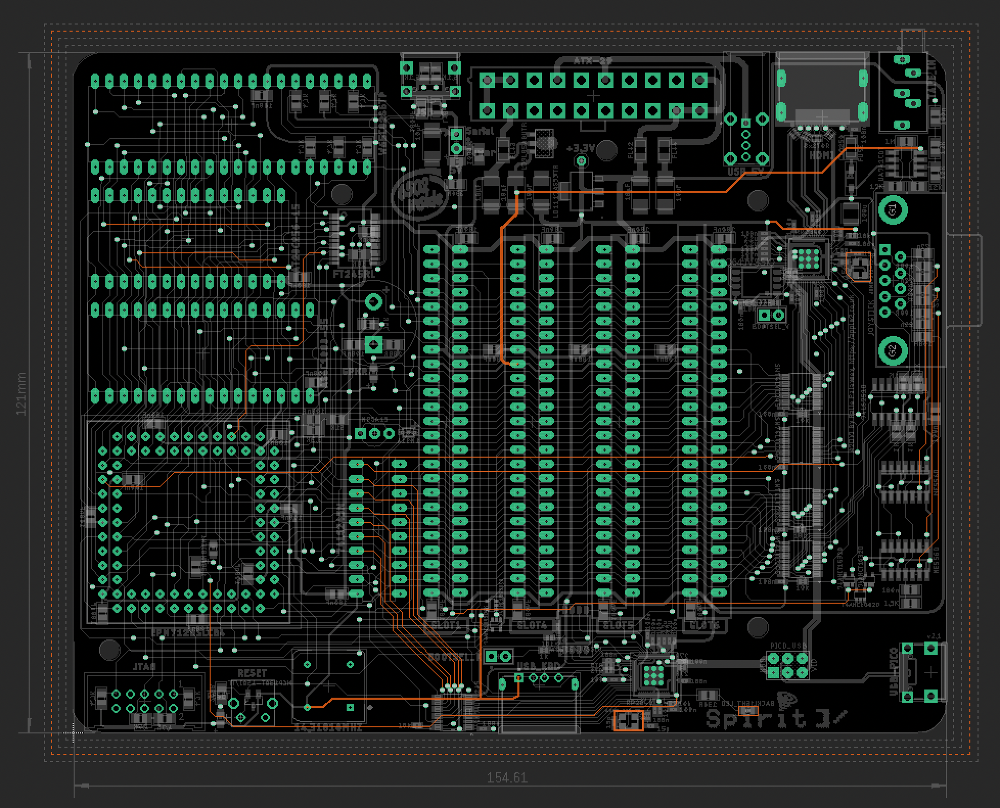

<p align="center">
  
  </br>
  <font size="6">Pronounce <b>CBS</b> : <b>C</b><i>losed</i> <b>B</b><i>racket</i> <b>S</b><i>lash</i></font>
  </br>
  <font size="4">Work In Progress</font>
</p>



This is an attempt to build a computer somewhere in the middle of an Apple ][ and an Apple //e. So its name is Spirit ]/ (a computer with Apple II series in mind). Since the WAF (Wife Acceptance Factor) of the Apple // form factor (with disk drives and display) is somewhere near zero, I'm looking for something smaller. The first PCB iteration was half size of the System 2 with only a single slot. But one slot is really not enough.

So my requirements were :

• Small (For example I choosed Pico ATX and single chips for SRAM(128K) and EEPROM).

• Compatibility with floppy drives (I ❤ how they are sounding).

• Slots. Some hardware Apple II projects exist, but I want floppies and the ability to use some of the cards from my drawers.

• Not necessary 100% compatible.

• Remove on board video to simplify design and HDMI is now possible.

• USB / RF Keyboard

• A2 Joystick

• SSC over USB (FT245) if I have enough space in the CPLD.

3 designs are planned :

• System 1 : 12cm x 12cm board for POC. 4 slots (3 + 1 since slot 0 is a ghost of slot 2 which I used for the keyboard)

• System 2 : 12cm x 14cm board with embeded USB keybpard support. 5 slots.

• System 3 : Apple //c form factor motherboard with //c keyboard support and A2DVI. 3 slots (small form factor. A2heaven like)

For this actual design, I tried to find the right balance between CPLD pins count, the fewest number of external chips and CPLD size for vhdl coding. So the actual result is not perfect but a quite good compromise in my own opinion.

Until now, Disk ][, A2Pico (SD Card), A2DVI and PRODOS-ROM cards were succesfully tested. Since native video generation is not implemented, some games may not working. I will study the possibility to emulate Blanking Softswitches and maybe vapor bits if I can find enough space in the CPLD.



# Motherboard

The needed functions of MMU & IOU are coded inside a single CPLD (EPM7128 from Altera).

<p align="center">
  
  </br>
</p>

## PCB
Since size matter here, all resistors, capacitors and leds are SMD. Sorry for through holes fans ;-) But I kept DIL for the main ICs (except FT245).
System 1 & 2 boards density requires a 4 layers design. System will be a classical 2 layers design.

## CPLD vhdl code
I choosed to start from [Apple-II_MiSTer](https://github.com/MiSTer-devel/Apple-II_MiSTer) implementation. Then I made modifications for real hardware interfacing. Finally the vhdl code is quite small.

## USB
The FT245RL is chip was used for initial debugging. When the vhdl code began to be too big, I've build a separate card to do 6502 buses debugging over an USB link. I'm waiting for the next version of the motherboard to check if an I can use the FT245 chip to emulate an onboard Super Serial Card. If SSC can not fit in the CPLD, FT245 may be removed from future designs.

USB Keyboard support is mentionned below.

# Keyboard card

The RP2040 act as the 3660 Pro encoder from the original Apple II. So it generates AKD and KSTRB signals and 7bits ASCII. The pico chip generates the autorepeat features. This is one more thing not to be implemented in the CPLD. The next card release will implement the CTRL-ALT-RESET combination. 2 flavors : USB and //c keyboard.

## build Pico code

```bash
mkdir pico/keyboard/build
cd pico/keyboard/build
cmake ..
git submodule update --init --recursive
make
```

Drag and drop file SpiritKBDBoard.uf2 to the pico
